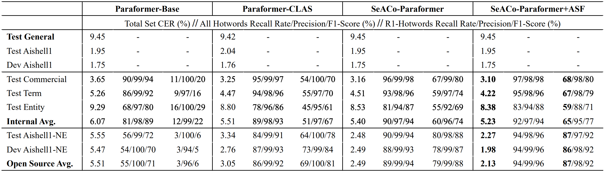
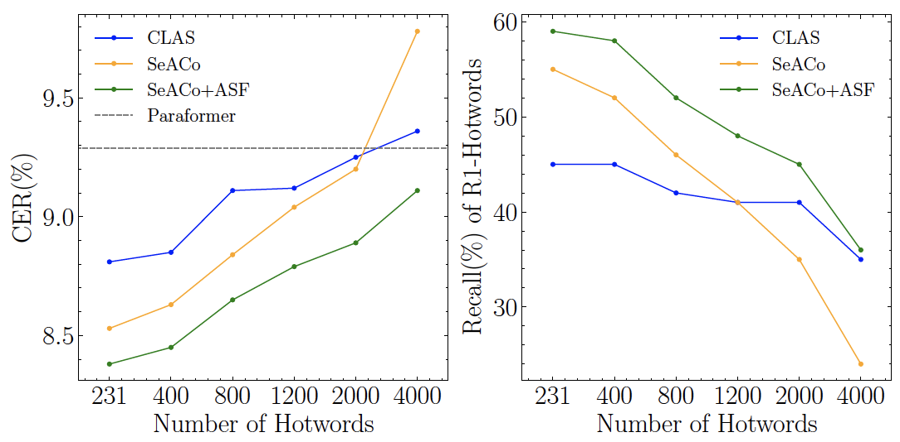
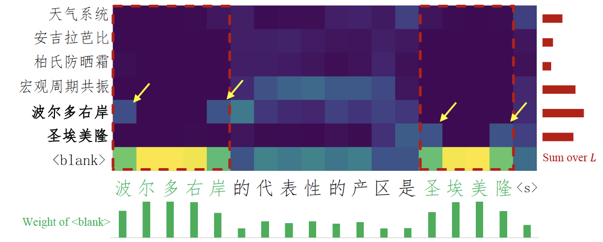

# SeACo-Paraformer

## Introduction
**Se**mantic **A**ugmented **Co**ntextual-Paraformer (SeACo-Paraformer) is a non-autoregressive E2E ASR system with flexible and effective hotword customization ability which follows the main idea of [CLAS](https://arxiv.org/pdf/1808.02480.pdf) and [ColDec](https://arxiv.org/pdf/2012.09466.pdf).
This repo is built for showing (1) detailed experiment results; (2) source codes; (3) open model links; (4) open hotword customization test sets based on Aishell-1 as discussed in our paper.
## Paper
SeACo-Paraformer: A Non-Autoregressive ASR System with Flexible and Effective Hotword Customization Ability <a href="https://arxiv.org/abs/2308.03266"></a>
## Source Codes
The model proposed and compared in the paper are implemented with FunASR <a href='https://github.com/alibaba-damo-academy/FunASR'></a>, which is a open source ASR toolkit.
1. Paraformer Model <a href="https://arxiv.org/abs/2206.08317"></a>: [source code](https://github.com/alibaba-damo-academy/FunASR/tree/main/funasr/models/paraformer)
2. Paraformer-CLAS Model <a href="https://arxiv.org/abs/2305.11013"></a>: [source code](https://github.com/alibaba-damo-academy/FunASR/tree/main/funasr/models/contextual_paraformer)
3. SeACo-Paraformer Model <a href="https://arxiv.org/abs/2308.03266"></a>: [source code](https://github.com/alibaba-damo-academy/FunASR/tree/main/funasr/models/seaco_paraformer)
## Model Links
[Modelscope](https://modelscope.cn/models) is a open platform for sharing models, AI spaces and datasets. We open our industrial models discussed in the paper through Modelscope:
1. Paraformer Model: [model link](https://modelscope.cn/models/damo/speech_paraformer-large_asr_nat-zh-cn-16k-common-vocab8404-pytorch/summary)
2. Paraformer-CLAS Model: [model link](https://modelscope.cn/models/damo/speech_paraformer-large-contextual_asr_nat-zh-cn-16k-common-vocab8404/summary)
3. SeACo-Paraformer Model: will be released once paper is accepted: [model link](https://modelscope.cn/models/iic/speech_seaco_paraformer_large_asr_nat-zh-cn-16k-common-vocab8404-pytorch/summary)
## How to Reproduce the Results
With FunASR <a href='https://github.com/alibaba-damo-academy/FunASR'></a> toolkit, you can use many ASR models to recognize, which include different language ASR models, different model architectures like SeACo-Paraformer

The following code conducts ASR with hotword customization:
```python
from funasr import AutoModel

model = AutoModel(model="iic/speech_seaco_paraformer_large_asr_nat-zh-cn-16k-common-vocab8404-pytorch",
                  model_revision="v2.0.4",
                  device="cuda:0"
                  )

res = model.generate(input="YOUR_PATH/aishell1_hotword_dev.scp",
                     hotword='./data/dev/hotword.txt',
                     batch_size_s=300,
                    )
fout1 = open("dev.output", 'w')
for resi in res:
    fout1.write("{}\t{}\n".format(resi['key'], resi['text']))

res = model.generate(input="YOUR_PATH/aishell1_hotword_test.scp",
                     hotword='./data/test/hotword.txt',
                     batch_size_s=300,
                    )
fout2 = open("test.output", 'w')
for resi in res:
    fout2.write("{}\t{}\n".format(resi['key'], resi['text']))
```
## Open Hotword Customization Test Sets
Previous hotword customization related works have seen performance reported on internal test sets, we hope to provide a common testbed for testing the customization ability of models. 

Based on a famous Mandarin speech dataset - Aishell-1, we filtered two subsets from test and dev set and prepare hotword lists for them.
Find them in `data/test` and `data/dev`, you may download the entire [Aishell-1](https://www.openslr.org/33/) and filter out the subset *Test-Aishell1-NE* and *Dev-Aishell1-NE* with `data/test/uttid` and `data/dev/uttid` respectively. And we prepare the entire hotword list `hotword.txt` and R1-hotword list `r1-hotword.txt` for them (R1-hotword stands for hotwords whose recall rate on a general ASR model recognition results is lower than  40%)
|                  | #utt | #hotwords | #R1-hotwords |
|------------------|------|-----------|--------------|
| Test-Aishell1-NE | 808  | 400       | 226          |
| Dev-Aishell1-NE  | 1334 | 600       | 371          |
## Experiment Results
### In the Paper
Result1: Comparing the models



Result2: Ablation study over bias decoder calculation


Result3: Performance comparision with larger incoming hotword list



Result4: Attention score matrix analysis



